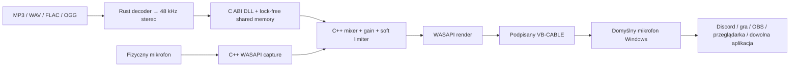

<div align="center">

# 🔊 Soundboard Binder

### Jeden soundboard. Jeden wybrany mikrofon. Dźwięk w każdej aplikacji Windows.

<p>
  
  
  
  
  
</p>

<p>
  
  
  
  
  
  
</p>

Soundboard Binder miesza **Twój fizyczny mikrofon + dowolny bind** w natywnym silniku C++ i wystawia gotowy sygnał jako **domyślny mikrofon Windows**. Bez VoiceMeetera, bez „Nasłuchuj tego urządzenia”, bez ręcznego klikania w panelu VB-CABLE. Discord, gra czy przeglądarka po prostu słyszą Ciebie **i** Twoje bindy.

</div>

---

<table align="center">
  <thead>
    <tr>
      <th align="center">🟣 &nbsp; SOUNDBOARD BINDER &nbsp; / &nbsp; LIVE DEMO &nbsp; 🟢</th>
    </tr>
  </thead>
  <tbody>
    <tr>
      <td align="center">
        
      </td>
    </tr>
    <tr>
      <td align="center">
        <details>
          <summary><strong>▶ Odtwórz animowane demo</strong> &nbsp;·&nbsp; GIF 33,6 MB</summary>
          <br>
          
        </details>
      </td>
    </tr>
  </tbody>
</table>

<p align="center">
  <sub>Lekka okładka ładuje się od razu. Ciężki GIF pojawia się dopiero po rozwinięciu sekcji — README GitHuba nie pozwala uruchomić własnego JavaScriptowego loadera.</sub>
</p>

---

## 📑 Spis treści

- [Dlaczego to jest inne](#-dlaczego-to-jest-inne)
- [Funkcje w pigułce](#-funkcje-w-pigułce)
- [Użycie — patologicznie proste](#-użycie--patologicznie-proste)
- [Jak wpuścić binda do Discorda](#-jak-wpuścić-binda-do-discorda)
- [Jak płynie dźwięk](#-jak-płynie-dźwięk)
- [Co jest ciekawego pod maską](#-co-jest-ciekawego-pod-maską)
- [Jeden EXE — co jest w środku](#-jeden-exe--co-dokładnie-jest-w-środku)
- [Uruchomienie ze źródeł](#️-uruchomienie-ze-źródeł)
- [Struktura projektu](#️-struktura-projektu)
- [Najczęstsze problemy](#-najczęstsze-problemy)

---

## 🎯 Dlaczego to jest inne

Klasyczny soundboard każe Ci ręcznie spinać wirtualne kable, włączać „nasłuchiwanie urządzenia” i modlić się, żeby Discord to złapał. Soundboard Binder robi to za Ciebie:

- **Cała trasa audio jest zarządzana przez aplikację.** Wybierasz swój prawdziwy mikrofon w jednym dropdownie i to koniec konfiguracji.
- **Miks powstaje natywnie w C++,** nie w JavaScript i nie w przeglądarce — hot path capture/render siedzi bezpośrednio na WASAPI.
- **Wirtualny mikrofon staje się domyślnym urządzeniem Windows** dla wszystkich trzech ról (Console, Multimedia, Communications), więc aplikacje na „Default” przełączają się same.
- **Jeden plik do pobrania.** Sterownik, natywny silnik i biblioteka C są zaszyte w EXE.

---

## ✨ Funkcje w pigułce

| Obszar | Co dostajesz |
|---|---|
| 🎙️ **Miks na żywo** | Twój głos + dowolny bind w jednym strumieniu, mieszane w czasie rzeczywistym w C++ |
| 🎚️ **Niezależne wzmocnienia** | `Microphone gain` 0–300% i `Soundboard gain` (turbo) 0–600% — oba w jednym panelu, z miękkim limiterem `tanh` na końcu |
| 🧭 **Routing systemowy** | Wirtualny mikrofon ustawiany jako domyślny dla ról Console / Multimedia / Communications, z przywróceniem poprzedniego stanu |
| 📊 **Podgląd na żywo** | Mierniki `MIC` i `FINAL MIX`, licznik XRUN, PID ukrytego silnika, wersja protokołu IPC |
| ⏹️ **Sterowanie odtwarzaniem** | Play z kafelka, `Stop playback` i restart silnika bezpośrednio w panelu Native Audio Engine |
| 🏷️ **Nazwa mikrofonu** | Zmieniasz nazwę wirtualnego mikrofonu widoczną w Discordzie / grach jednym kliknięciem (z elewacją UAC) |
| 🔎 **Czytelne urządzenia** | Lista mikrofonów pokazuje pełną etykietę (`nazwa · sterownik/producent`), żeby jednoznacznie trafić we własny sprzęt |
| ⬇️ **Import z URL** | YouTube / Shorts / TikTok przez `yt-dlp` + `ffmpeg` (opcjonalne), plus lokalne MP3/WAV/FLAC/OGG/M4A/AAC |
| 🛡️ **Bezpieczny sterownik** | Oficjalny, podpisany VB-CABLE Pack45 zaszyty w aplikacji i weryfikowany po SHA-256 przed instalacją |
| 🧵 **Osobny proces audio** | Silnik działa poza WebView; heartbeat wykrywa śmierć UI i bezpiecznie kończy strumień |

---

## ⚡ Użycie — patologicznie proste

### 1. Uruchom jeden plik

Pobierz **`Soundboard-Binder-Setup.exe`** z [Releases](../../releases/latest) i uruchom go. Użytkownik końcowy nie instaluje Node.js, npm, Rusta, Visual Studio ani osobnych DLL-ek.

Możesz też użyć **`Soundboard-Binder-portable.exe`** — to jeden surowy plik aplikacji, ale komputer musi już mieć Microsoft WebView2 Runtime.

### 2. Przy pierwszym starcie zaakceptuj UAC

Jeśli VB-CABLE nie jest zainstalowany, aplikacja automatycznie:

1. sprawdza SHA-256 osadzonej, oficjalnej paczki `VBCABLE_Driver_Pack45.zip`;
2. rozpakowuje ją wyłącznie do katalogu tymczasowego;
3. uruchamia w tle podpisany instalator VB-Audio z uprawnieniami administratora;
4. sprząta pliki tymczasowe i uruchamia własny interfejs.

Nie otwiera się `VBCABLE_ControlPanel.exe`. Po instalacji Windows może wymagać jednego restartu — aplikacja pokaże wtedy komunikat.

> Sterownik pozostaje niezmodyfikowanym **VB-CABLE Pack45** autorstwa [VB-Audio](https://vb-audio.com/Cable/). To oprogramowanie donationware. Źródło paczki, zasady dystrybucji i hash znajdują się w [`src-tauri/resources/vbcable/NOTICE.md`](src-tauri/resources/vbcable/NOTICE.md).

### 3. Wybierz swój prawdziwy mikrofon

W panelu **Native audio engine** rozwiń **„Your real microphone”** i wybierz sprzęt, z którego normalnie mówisz (np. mikrofon ze słuchawek). Lista pokazuje pełne etykiety, więc łatwo odróżnisz swój zestaw od innych urządzeń. To wszystko — silnik C++ zaczyna przechwytywać głos, a każdy bind domiesza do tego samego strumienia.

W tym samym panelu masz komplet sterowania:

- `Microphone gain` — poziom głosu przed miksem (0–300%);
- `Soundboard gain` — booster bindów z zakresem turbo (0–600%);
- mierniki `MIC` i `FINAL MIX` na żywo;
- `Stop playback` — natychmiast ucina grający bind;
- PID silnika, wersję protokołu IPC, licznik XRUN i bezpieczny restart audio engine.

### 4. Dodaj plik i kliknij Play

Obsługiwane są m.in. MP3, WAV, FLAC, OGG, M4A i AAC. Soundboard dekoduje plik do stereo 48 kHz, przesyła PCM przez pamięć współdzieloną i miesza go z mikrofonem bez zapisywania pliku pośredniego. Możesz też wkleić link i wciągnąć audio przez `yt-dlp`.

### 5. Discord, gry, przeglądarka i reszta

Przy starcie Soundboard Binder ustawia swój wirtualny mikrofon jako domyślny dla trzech ról Windows. Programy używające opcji **Default / Domyślne urządzenie** przełączą się automatycznie. Szczegóły dla Discorda niżej.

---

## 🎧 Jak wpuścić binda do Discorda

Ten sam poradnik jest **wbudowany w aplikację** (panel „Hear binds in Discord”), ale zostaje też tutaj:

1. Otwórz ustawienia głosu — w Discordzie to **Ustawienia użytkownika → Głos i wideo**.
2. **Urządzenie wejściowe → `Default`** albo wprost nazwa Twojego wirtualnego mikrofonu (np. `Soundboard Binder Microphone`).
3. **Wyłącz** Redukcję szumów / Krisp, Echo Cancellation i Automatyczną regulację czułości — traktują bind jak szum i go wyciszają.
4. Jeśli bind dalej ucina, obniż próg czułości wejścia albo przełącz na „Naciśnij, aby mówić”.

> **Uwaga na częsty błąd:** nie przypinaj w Discordzie bezpośrednio swojego fizycznego mikrofonu i nie rób go domyślnym w Windows. Twój głos idzie wtedy z pominięciem miksu, a bindy żyją **wyłącznie** na wirtualnym kablu. Prawdziwy mikrofon wybierasz **w aplikacji**, a Discorda zostawiasz na `Default`.

Po normalnym wyjściu aplikacja natychmiast przywraca wcześniejsze urządzenia domyślne. Po awarii robi to watchdog silnika po utracie heartbeat. Jeśli w trakcie działania ręcznie zmienisz mikrofon Windows na inny, Soundboard Binder nie nadpisze tej decyzji przy zamykaniu.

---

## 🧭 Jak płynie dźwięk



To nie jest wstrzykiwanie DLL do Discorda ani hookowanie obcych procesów. Zarówno Rust, jak i ukryty proces C++ ładują własną DLL C. Komunikacja odbywa się przez wersjonowaną pamięć współdzieloną i eventy Windows.

---

## 🧠 Co jest ciekawego pod maską

- **Natywny hot path.** Capture i render działają bezpośrednio na WASAPI w trybie event-driven, z wątkiem MMCSS. Callback renderujący nie alokuje pamięci na stercie.
- **Lock-free audio IPC.** Dwusekundowy bufor SPSC przenosi stereo `float32` przy 48 kHz pomiędzy Rustem i C++ bez serializacji JSON i bez lokalnego serwera.
- **Osobny proces audio.** Zawieszenie WebView nie zatrzymuje od razu strumienia. Heartbeat wykrywa śmierć UI i bezpiecznie kończy engine.
- **Miks głosu i bindów.** Wzmocnienie mikrofonu i soundboardu jest niezależne, a na końcu działa miękki limiter `tanh`, który ogranicza brutalny clipping przy zakresie turbo.
- **System-wide routing.** Silnik zapisuje wcześniejsze endpointy dla ról Console, Multimedia i Communications, przełącza Windows na wirtualny miks i warunkowo przywraca poprzedni stan (nieudokumentowany `IPolicyConfig`).
- **Zmiana nazwy urządzenia.** Nazwa wirtualnego mikrofonu jest zapisywana jako `PKEY_Device_FriendlyName` na endpoincie kabla — w elewowanym procesie pomocniczym.
- **Stabilne urządzenia.** Konfiguracja przechowuje surowe identyfikatory endpointów WASAPI, nie tylko zmienne nazwy widoczne w panelu dźwięku.
- **Płynne UI bez migotania.** Interfejs aktualizuje mierniki i pasek postępu punktowo; pełne przerysowanie odpala się tylko przy realnej zmianie stanu, więc kafelki nie „skaczą” pod kursorem.
- **Jedna instancja.** Nazwane mutexy chronią zarówno aplikację, jak i engine przed dwoma procesami walczącymi o wspólny routing.
- **Jeden plik do dystrybucji.** DLL C i EXE C++ są kompilowane przez `build.rs`, osadzane przez `include_bytes!`, a potem wypakowywane do wersjonowanego katalogu `%LOCALAPPDATA%\soundboard-binder\native\<hash>`.
- **Sterownik z kontrolą integralności.** Oficjalna paczka VB-CABLE jest zaszyta w aplikacji i przed instalacją sprawdzana względem znanego SHA-256.
- **Import URL jest opcjonalny.** YouTube / Shorts / TikTok korzystają z zewnętrznych `yt-dlp` i `ffmpeg`; lokalny soundboard nie potrzebuje tych narzędzi.

---

## 📦 Jeden EXE — co dokładnie jest w środku

| Wariant | Dla kogo | Wynik |
|---|---|---|
| **Setup** — zalecany | zwykły użytkownik, WebView2 offline | `release/Soundboard-Binder-Setup.exe` |
| **Portable** | komputer z istniejącym WebView2 | `release/Soundboard-Binder-portable.exe` |

Oba warianty zawierają frontend, backend Rust, natywną DLL C, ukryty engine C++ i oficjalną paczkę sterownika. Są jednym plikiem **do pobrania i uruchomienia**. Windowsowy sterownik oraz natywne komponenty muszą jednak fizycznie istnieć na dysku podczas działania, dlatego program instaluje sterownik w systemie i wypakowuje własny runtime do LocalAppData. Tego ograniczenia Windows nie da się uczciwie ominąć „magicznym EXE”.

---

## 🛠️ Uruchomienie ze źródeł

### Wymagania

- Windows 10 lub 11 x64;
- [Node.js](https://nodejs.org/) 20+;
- [Rust stable](https://rustup.rs/) (toolchain MSVC);
- Visual Studio 2022 lub Build Tools z workloadem **Desktop development with C++**;
- WebView2 Runtime;
- opcjonalnie `yt-dlp` + `ffmpeg` dla importu z URL.

> **Nie musisz otwierać Visual Studio ani dodawać plików do żadnego projektu.** [`src-tauri/build.rs`](src-tauri/build.rs) sam wykrywa MSVC przez `vswhere`, kompiluje C i C++ poleceniem `cl` i osadza wyniki w binarce Rusta. Cały build jest sterowany komendami npm — IDE potrzebujesz tylko raz, żeby zainstalować sam kompilator C++.

### Development

```powershell
npm install
npm run tauri dev
```

Frontend przeładowuje się na żywo, Rust rekompiluje się przy zmianach, a natywny C/C++ tylko wtedy, gdy zmienią się jego pliki źródłowe. Skrypt [`scripts/tauri.mjs`](scripts/tauri.mjs) automatycznie dopisuje `%USERPROFILE%\.cargo\bin` do `PATH` uruchamianego procesu, naprawiając błąd:

```text
failed to run cargo metadata: program not found
```

Jeśli chcesz naprawić `cargo` również globalnie dla nowych terminali:

```powershell
[Environment]::SetEnvironmentVariable(
  "Path",
  [Environment]::GetEnvironmentVariable("Path", "User") + ";$env:USERPROFILE\.cargo\bin",
  "User"
)
```

Potem zamknij i otwórz terminal oraz sprawdź `cargo --version`.

### Build

```powershell
npm run build:all
```

Albo osobno:

```powershell
npm run build:installer
npm run build:portable
```

Nie trzeba osobno uruchamiać CMake ani ręcznie kopiować DLL — wszystko robi `build.rs` i [`scripts/tauri.mjs`](scripts/tauri.mjs).

### Testy i diagnostyka

```powershell
cd src-tauri
cargo test
cargo run --example default_input
cargo run --example native_probe
cargo run --example native_probe -- tone
```

Przykłady diagnostyczne pokazują aktualny domyślny mikrofon, status IPC/engine oraz potrafią wysłać kontrolny ton 440 Hz do działającego miksera.

---

## 🗂️ Struktura projektu

```text
soundboard-tauri-rust/
├── native-audio/
│   ├── protocol/              # wspólny layout IPC v2 (shared memory + eventy)
│   ├── bridge/                # DLL w C: ABI + named shared memory
│   └── engine/                # ukryty EXE C++: WASAPI capture/render + mixer + routing
├── src/                       # UI Vite / JavaScript / CSS
├── src-tauri/
│   ├── src/native_audio.rs    # lifecycle, FFI, ekstrakcja runtime i dekoder PCM
│   ├── src/virtual_audio.rs   # sterownik, detekcja i nazwa endpointu
│   ├── src/lib.rs             # state i komendy Tauri
│   ├── src/main.rs            # single-instance + helper zmiany nazwy endpointu
│   ├── build.rs               # kompilacja C/C++ przez MSVC i osadzanie binarek
│   ├── examples/              # diagnostyka endpointów i IPC
│   └── resources/vbcable/     # oficjalny Pack45 + nota licencyjna
├── scripts/tauri.mjs          # odporny runner + build Setup/Portable
├── docs/                      # okładka i GIF demo
└── release/                   # lokalne artefakty produkcyjne
```

---

## ✅ Najczęstsze problemy

<details>
<summary><strong>cargo metadata: program not found</strong></summary>

Rust nie znajduje się w `PATH`. Użyj `npm run tauri dev`, które naprawia PATH dla procesu, albo wykonaj globalną komendę z sekcji Development i otwórz nowy terminal.

</details>

<details>
<summary><strong>Engine pokazuje „Wybierz prawdziwy mikrofon”</strong></summary>

W panelu Native audio engine wybierz urządzenie inne niż `CABLE Output`. Fizyczny mikrofon jest źródłem, a VB-CABLE — gotowym wyjściem miksu. Lista pokazuje pełne etykiety, więc łatwiej trafić we właściwe urządzenie.

</details>

<details>
<summary><strong>Discord nie słyszy bindów</strong></summary>

Ustaw wejście Discorda na `Default` (albo wprost nazwę wirtualnego mikrofonu) i wyłącz Redukcję szumów / Krisp, Echo Cancellation oraz Automatyczną regulację czułości — to one najczęściej wyciszają bind, traktując go jak szum. Nie przypinaj tam swojego fizycznego mikrofonu: wtedy leci sam głos, bo bindy istnieją tylko na wirtualnym kablu. Pełny poradnik jest też wbudowany w aplikację (panel „Hear binds in Discord”).

</details>

<details>
<summary><strong>Zmiana nazwy mikrofonu „nie działa”</strong></summary>

Kliknij „Apply microphone name”, zaakceptuj monit UAC, a potem zrestartuj aplikację, która ma widzieć nową nazwę (Discord cache’uje listę urządzeń). Jeśli anulujesz elewację, nazwa się nie zmieni.

</details>

<details>
<summary><strong>Pierwszy start prosi o restart Windows</strong></summary>

To normalne po instalacji sterownika audio. Zrestartuj system i ponownie uruchom Soundboard Binder; instalator nie powinien pojawić się drugi raz.

</details>

<details>
<summary><strong>SmartScreen ostrzega przed aplikacją</strong></summary>

Sterownik VB-Audio jest podpisany przez jego producenta, ale własne EXE projektu również wymaga osobnego certyfikatu Authenticode. Bez niego Windows może ostrzegać przed nowym buildem mimo poprawnego kodu i podpisanego sterownika.

</details>

---

<div align="center">
  <strong>Rust zarządza. C przenosi próbki. C++ robi hałas. 🔊</strong>
</div>
