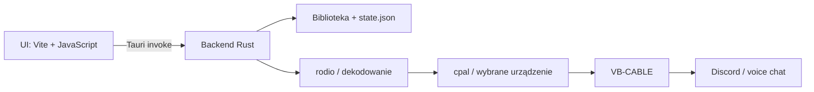

<div align="center">

# 🔊 Soundboard Binder

### Lekki soundboard dla Windows, który wpina dźwięki prosto w Discorda

<p>
  
  
  
  
  
  
</p>

<p>
  
  
  
</p>

Soundboard Binder odtwarza lokalne klipy na wybranym urządzeniu audio, pamięta bibliotekę i ustawienia, pokazuje postęp oraz poziom sygnału, a z pomocą VB-CABLE przekazuje wszystko jako mikrofon do komunikatora.

</div>

---

<table align="center">
  <thead>
    <tr>
      <th align="center">
        🟣 &nbsp; SOUNDBOARD BINDER &nbsp; / &nbsp; LIVE DEMO &nbsp; 🟢
      </th>
    </tr>
  </thead>
  <tbody>
    <tr>
      <td align="center">
        
      </td>
    </tr>
    <tr>
      <td align="center">
        <details>
          <summary><strong>▶ Odtwórz animowane demo</strong> &nbsp;·&nbsp; GIF 33,6 MB</summary>
          <br>
          
        </details>
      </td>
    </tr>
  </tbody>
</table>

<p align="center">
  <sub>Okładka ładuje się natychmiast. GIF jest pobierany po rozwinięciu demonstracji.</sub>
</p>

---

## ⚡ Uruchomienie — patologicznie prosto

### 1. Zainstaluj aplikację

Pobierz **`Soundboard-Binder-Setup.exe`** z zakładki [Releases](../../releases/latest) i uruchom. To jeden instalator EXE z dołączonym WebView2 — nie potrzebuje Node.js, npm ani Rusta na komputerze użytkownika.

> Windows może pokazać ostrzeżenie SmartScreen, dopóki plik nie zostanie podpisany certyfikatem code-signing.

### 2. Zainstaluj podpisany wirtualny kabel

1. Pobierz najnowszy **VB-CABLE Driver Pack** z [oficjalnej strony VB-Audio](https://vb-audio.com/Cable/).
2. Rozpakuj paczkę.
3. Uruchom instalator sterownika jako administrator.
4. Po instalacji uruchom ponownie komputer.

VB-CABLE tworzy parę urządzeń. To, co aplikacja wysyła do wejścia kabla, pojawia się po drugiej stronie jako wirtualny mikrofon.

> VB-CABLE jest oprogramowaniem donationware autorstwa [VB-Audio](https://vb-audio.com/). Jeżeli jest dla Ciebie przydatne, możesz wesprzeć jego twórców lub kupić licencję na stronie producenta.

### 3. Ustaw routing

| Gdzie | Co wybrać |
|---|---|
| Soundboard Binder → **Output device** | `CABLE In 16ch` lub `CABLE Input` |
| Discord → **Ustawienia → Głos i wideo → Urządzenie wejściowe** | `CABLE Output (VB-Audio Virtual Cable)` |
| Discord → **Urządzenie wyjściowe** | Twoje normalne słuchawki/głośniki |

```text
Soundboard Binder
       │
       ▼
CABLE In 16ch / CABLE Input
       │  VB-CABLE
       ▼
CABLE Output
       │
       ▼
Discord jako mikrofon
```

### 4. Dodaj dźwięk i graj

1. Kliknij **Add local audio**.
2. Wybierz plik MP3, WAV, FLAC, OGG, M4A albo AAC.
3. Ustaw głośność — maksymalnie **600%**.
4. Kliknij **Play**.

Jeżeli Discord wycina krótkie klipy, wyłącz dla testu **Krisp / tłumienie szumów**, automatyczną czułość wejścia i automatyczną regulację wzmocnienia.

### Chcesz jednocześnie mówić i puszczać dźwięki?

Discord z wejściem `CABLE Output` słyszy kabel, a nie bezpośrednio fizyczny mikrofon. Głos trzeba więc domieszać do tego samego kabla:

- najlepiej przez **VoiceMeeter** — mikrofon i soundboard trafiają na jedno wyjście wirtualne;
- najprościej przez Windows: **Mikrofon → Właściwości → Nasłuchiwanie → Nasłuchuj tego urządzenia**, a jako urządzenie odtwarzające wybierz `CABLE Input`. Ta metoda może dodać niewielkie opóźnienie.

## 📦 Jeden EXE: instalator czy portable?

Projekt produkuje dwa świadomie rozdzielone warianty:

| Wariant | Zastosowanie | Wynik |
|---|---|---|
| **Setup** — zalecany | Dla zwykłego użytkownika; instaluje aplikację i ma offline’owy WebView2 | `release/Soundboard-Binder-Setup.exe` |
| **Portable** | Jeden surowy plik aplikacji; Windows musi już mieć WebView2 | `release/Soundboard-Binder-portable.exe` |

Frontend, CSS, JavaScript i backend Rust są zaszyte w pliku programu. Do zwykłego odtwarzania lokalnych dźwięków nie trzeba kopiować obok żadnego folderu `dist`, DLL-ek ani `node_modules`.

Import z YouTube / Shorts / TikToka jest funkcją opcjonalną i nadal korzysta z zewnętrznych narzędzi [`yt-dlp`](https://github.com/yt-dlp/yt-dlp/releases/latest) oraz [`ffmpeg`](https://ffmpeg.org/download.html). Oba polecenia muszą być dostępne w systemowym `PATH`.

## 🛠️ Uruchomienie ze źródeł

### Wymagania deweloperskie

- Windows 10 lub 11,
- [Node.js](https://nodejs.org/) 20+,
- [Rust stable](https://rustup.rs/),
- Microsoft C++ Build Tools,
- WebView2 Runtime,
- opcjonalnie `yt-dlp` + `ffmpeg` dla importu URL.

### Development

```powershell
npm install
npm run tauri dev
```

Skrypt uruchomieniowy sam dopisuje `%USERPROFILE%\.cargo\bin` do `PATH` procesu, jeśli Rust jest tam zainstalowany. Dzięki temu projekt uruchomi się również wtedy, gdy Windows zgubił użytkownikowi wpis `cargo` w zmiennej środowiskowej.

### Build pojedynczego instalatora

```powershell
npm run build:installer
```

Gotowy plik:

```text
release/Soundboard-Binder-Setup.exe
```

### Build pojedynczego portable EXE

```powershell
npm run build:portable
```

Gotowy plik:

```text
release/Soundboard-Binder-portable.exe
```

## 🧠 Co jest ciekawego pod maską?



- **Zero lokalnego serwera.** UI rozmawia z Rustem przez komendy Tauri (`invoke`), a nie przez HTTP.
- **Prawdziwy wybór urządzenia.** `cpal` enumeruje wyjścia Windows, a `rodio` otwiera strumień dokładnie na wybranym urządzeniu.
- **Odporność na zmiany sprzętu.** Jeżeli zapisane słuchawki albo kabel znikną, aplikacja automatycznie wybiera aktualne domyślne wyjście zamiast wywalać start.
- **Miernik bez ciężkiego DSP na żywo.** Przy dodawaniu pliku backend liczy RMS w odcinkach po około 100 ms i zapisuje lekki profil poziomu. UI może potem płynnie pokazywać dBFS bez ponownego dekodowania całego audio przy każdym odświeżeniu.
- **Gain do `6.0`.** Suwak 600% steruje bezpośrednio głośnością aktywnego `Player`; to celowy zakres „soundboardowy”, więc łatwo również przesterować sygnał.
- **Strumień żyje tak długo jak klip.** `MixerDeviceSink` jest trzymany w `ActivePlayback`; jego przypadkowe upuszczenie natychmiast zatrzymałoby dźwięk.
- **Stan przetrwa restart.** Biblioteka, głośność i urządzenie są serializowane przez `serde` do `%APPDATA%\soundboard-binder\state.json`.
- **Pobrane audio ma własny katalog.** Importy URL trafiają do `%LOCALAPPDATA%\soundboard-binder\library`.
- **Mały artefakt portable.** W przeciwieństwie do Electrona aplikacja nie wozi całego Chromium — korzysta z systemowego WebView2.

## 🗂️ Struktura projektu

```text
soundboard-tauri-rust/
├── src/                  # interfejs i style
├── src-tauri/
│   ├── src/lib.rs        # biblioteka, audio, routing i komendy Tauri
│   ├── src/main.rs       # entrypoint Windows
│   └── tauri.conf.json   # okno, bundle i instalator NSIS
├── scripts/tauri.mjs     # odporny runner + build portable/setup
├── docs/                 # GIF/demo README
└── release/              # gotowe pliki EXE (lokalnie, poza gitem)
```

## ✅ Najczęstsze problemy

<details>
<summary><strong>Tauri pisze: cargo metadata — program not found</strong></summary>

Rust jest poza `PATH`. Ten projekt obchodzi problem przez `scripts/tauri.mjs`, jeżeli `cargo.exe` znajduje się w `%USERPROFILE%\.cargo\bin`. W nowym terminalu możesz też sprawdzić:

```powershell
cargo --version
```

</details>

<details>
<summary><strong>Aplikacja gra, ale Discord nic nie słyszy</strong></summary>

Sprawdź parę urządzeń: aplikacja wysyła do `CABLE Input` / `CABLE In 16ch`, a Discord odbiera z `CABLE Output`. Kliknij też **Refresh devices** po podłączeniu lub ponownej instalacji kabla.

</details>

<details>
<summary><strong>Portable EXE nie otwiera się na innym komputerze</strong></summary>

Użyj wariantu `Setup`. Portable zakłada obecność WebView2, natomiast instalator zawiera jego offline’ową instalację. VB-CABLE jako sterownik audio nadal trzeba zainstalować osobno i zrestartować Windows.

</details>

<details>
<summary><strong>Import z linku nie działa</strong></summary>

Sprawdź w terminalu:

```powershell
yt-dlp --version
ffmpeg -version
```

Jeżeli któregoś polecenia nie ma, zainstaluj narzędzie i dodaj jego katalog do `PATH`.

</details>

---

<div align="center">
  <strong>Rust robi hałas. VB-CABLE dostarcza go tam, gdzie trzeba.</strong>
</div>
