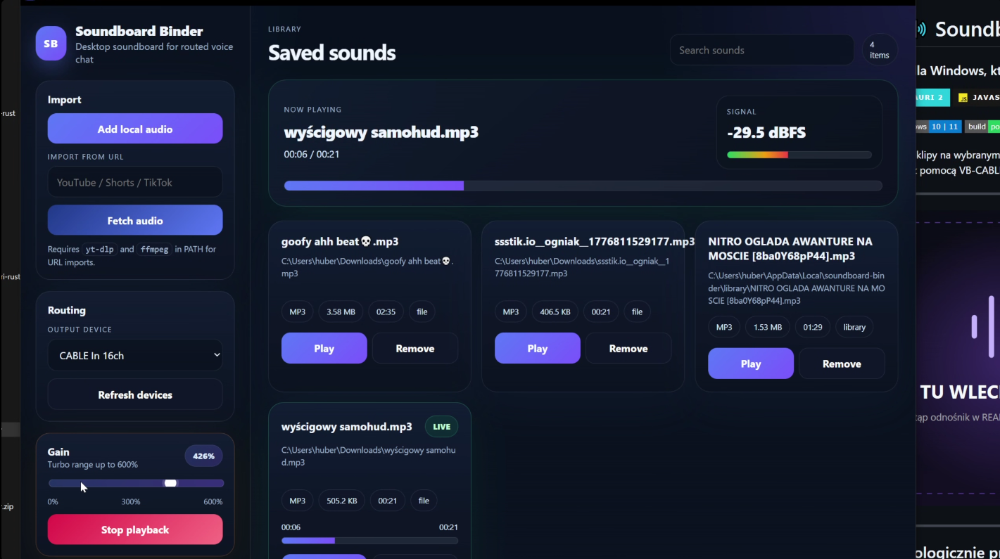
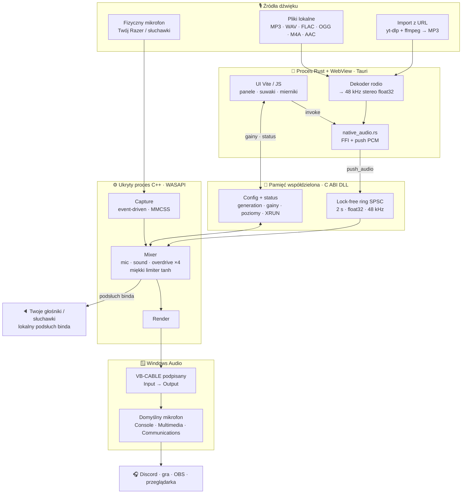

<div align="center">

# 🔊 Soundboard Binder

### Jeden soundboard. Jeden wybrany mikrofon. Dźwięk w każdej aplikacji Windows.

<p>
  
  
  
  
  
</p>

<p>
  
  
  
  
  
</p>

Miesza **Twój fizyczny mikrofon + dowolny bind** w natywnym silniku C++ i wystawia gotowy sygnał jako **domyślny mikrofon Windows**. Bez VoiceMeetera, bez „Nasłuchuj tego urządzenia”, bez klikania w panelu VB-CABLE.

</div>

---

<table align="center">
  <thead>
    <tr>
      <th align="center">🟣 &nbsp; SOUNDBOARD BINDER &nbsp; / &nbsp; LIVE DEMO &nbsp; 🟢</th>
    </tr>
  </thead>
  <tbody>
    <tr>
      <td align="center">
        
      </td>
    </tr>
    <tr>
      <td align="center">
        <details>
          <summary><strong>▶ Odtwórz animowane demo</strong> &nbsp;·&nbsp; GIF 33,6 MB</summary>
          <br>
          
        </details>
      </td>
    </tr>
  </tbody>
</table>

<p align="center">
  <sub>Lekka okładka ładuje się od razu. Ciężki GIF pojawia się dopiero po rozwinięciu sekcji — README GitHuba nie pozwala uruchomić własnego JavaScriptowego loadera.</sub>
</p>

---

## 🧭 Jak płynie dźwięk

Dwa procesy i jeden lock-free most między nimi. Twój głos i każdy bind spotykają się dopiero w natywnym mikserze C++, a wynik trafia prosto na wirtualny mikrofon systemowy:



To nie jest wstrzykiwanie DLL do Discorda ani hookowanie obcych procesów. Zarówno Rust, jak i ukryty proces C++ ładują własną DLL C, a komunikacja idzie przez wersjonowaną pamięć współdzieloną i eventy Windows.

---

## 🧱 Architektura — warstwa po warstwie

```text
   UŻYTKOWNIK
      │  klik / suwak
      ▼
━━ WEBVIEW ━━━━━━━━━━━━━━━━━━━━━━━━━━━━━━━━━━━━━━━━━━━━━━━━━━━  src/ · Vite + JS + CSS
   render() bez migotania · panele sterowania · mierniki na żywo
      │  Tauri IPC — komendy JSON
      ▼
━━ RDZEŃ RUST ━━━━━━━━━━━━━━━━━━━━━━━━━━━━━━━━━━━━━━━━━━━━━━━━  src-tauri/
   ├─ lib.rs            stan, config (state.json), komendy Tauri
   ├─ native_audio.rs   FFI do DLL, dekoder rodio → PCM 48 kHz, lifecycle
   ├─ virtual_audio.rs  detekcja / instalacja VB-CABLE, zmiana nazwy endpointu
   └─ build.rs          kompiluje C/C++ przez vswhere + cl, include_bytes!
      │  PCM (push_audio)                    │  gainy · poziomy · status
      ▼                                      ▼
━━ MOST C ━━━━━━━━━━━━━━━━━━━━━━━━━━━━━━━━━━━━━━━━━━━━━━━━━━━━  native-audio/bridge/ · soundboard_ipc.dll
   named shared memory · lock-free ring SPSC 2 s · eventy Windows · protokół IPC v3
      │
      ▼
━━ SILNIK C++ ━━━━━━━━━━━━━━━━━━━━━━━━━━━━━━━━━━━━━━━━━━━━━━━━  native-audio/engine/ · ukryty proces .exe
   WASAPI capture (MMCSS) → mixer(mic · sound · overdrive · tanh) → WASAPI render
   watchdog: heartbeat co 750 ms, śmierć UI → bezpieczny stop + przywrócenie defaultów
      │
      ▼
━━ WINDOWS ━━━━━━━━━━━━━━━━━━━━━━━━━━━━━━━━━━━━━━━━━━━━━━━━━━━  VB-CABLE (podpisany) · IPolicyConfig
   render → CABLE Input → CABLE Output = domyślny mikrofon dla 3 ról systemowych
      │
      ▼
   🎧  Discord · gry · OBS · przeglądarka · dowolna aplikacja Windows
```

Osobny proces audio oznacza, że zawieszenie WebView nie ucina od razu strumienia. Nazwane mutexy pilnują, żeby ani aplikacja, ani engine nie uruchomiły się dwa razy i nie biły się o wspólny routing.

---

## ✨ Funkcje w pigułce

| Obszar | Co dostajesz |
|---|---|
| 🎙️ **Miks na żywo** | Twój głos + dowolny bind w jednym strumieniu, mieszane w czasie rzeczywistym w C++ |
| 🎚️ **Niezależne wzmocnienia** | `Microphone gain` 0–300%, `Soundboard gain` 0–600% i dodatkowy `Overdrive` ×1–×4 (łącznie do 2400%) — wszystko w jednym panelu, z miękkim limiterem `tanh` na końcu |
| 🔈 **Podsłuch (monitor)** | Osobny suwak `Monitor` gra bind także na Twoim domyślnym wyjściu (głośniki/słuchawki), 0–200%, niezależnie od tego, co leci na Discorda; 0% = wyłączony |
| 🩺 **Self-test i diagnostyka** | Samotest C++ symuluje, czy bind jest słyszalny, a `scripts/diagnose.sh` sprawdza cały pipeline (toolchain, most C, silnik, sterownik, artefakty) i wypisuje raport |
| 🚨 **Baner błędów** | Krytyczne problemy (brak sterownika, silnik nie wstał) pojawiają się jako baner u góry aplikacji; reszta sprawdzeń chodzi w tle i niczego nie blokuje |
| 🧭 **Routing systemowy** | Wirtualny mikrofon ustawiany jako domyślny dla ról Console / Multimedia / Communications, z przywróceniem poprzedniego stanu |
| 📊 **Podgląd na żywo** | Mierniki `MIC` i `FINAL MIX`, licznik XRUN, PID ukrytego silnika, wersja protokołu IPC |
| ⏹️ **Sterowanie odtwarzaniem** | Play z kafelka, `Stop playback` i restart silnika bezpośrednio w panelu Native Audio Engine |
| 🏷️ **Nazwa mikrofonu** | Zmieniasz nazwę wirtualnego mikrofonu widoczną w Discordzie / grach jednym kliknięciem (z elewacją UAC) |
| 🔎 **Czytelne urządzenia** | Lista mikrofonów pokazuje pełną etykietę (`nazwa · sterownik/producent`), żeby jednoznacznie trafić we własny sprzęt |
| ⬇️ **Import z URL** | YouTube / Shorts / TikTok przez `yt-dlp` + `ffmpeg` (opcjonalne), plus lokalne MP3/WAV/FLAC/OGG/M4A/AAC |
| 🛡️ **Bezpieczny sterownik** | Oficjalny, podpisany VB-CABLE Pack45 zaszyty w aplikacji i weryfikowany po SHA-256 przed instalacją |
| 🧵 **Osobny proces audio** | Silnik działa poza WebView; heartbeat wykrywa śmierć UI i bezpiecznie kończy strumień |

---

## 🛠️ Uruchomienie ze źródeł

### Wymagania

- Windows 10 lub 11 x64;
- [Node.js](https://nodejs.org/) 20+;
- [Rust stable](https://rustup.rs/) (toolchain MSVC);
- Visual Studio 2022 lub Build Tools z workloadem **Desktop development with C++**;
- WebView2 Runtime;
- opcjonalnie `yt-dlp` + `ffmpeg` dla importu z URL.

> **Nie musisz otwierać Visual Studio ani dodawać plików do żadnego projektu.** [`src-tauri/build.rs`](src-tauri/build.rs) sam wykrywa MSVC przez `vswhere`, kompiluje C i C++ poleceniem `cl` i osadza wyniki w binarce Rusta. Cały build jest sterowany komendami npm — IDE potrzebujesz tylko raz, żeby zainstalować sam kompilator C++.

### Najszybciej — dwa kliknięcia

- **`scripts\install-tools.bat`** — pobiera `yt-dlp` + `ffmpeg` (import z URL) i dodaje je do `PATH`; sprawdza też, czy masz Node, Rust i C++ Build Tools.
- **`scripts\build.bat`** — robi `npm install` i pełny build produkcyjny do `release\` (Setup + Portable).

### Development

```powershell
npm install
npm run tauri dev
```

Frontend przeładowuje się na żywo, Rust rekompiluje się przy zmianach, a natywny C/C++ tylko wtedy, gdy zmienią się jego pliki źródłowe. Skrypt [`scripts/tauri.mjs`](scripts/tauri.mjs) automatycznie dopisuje `%USERPROFILE%\.cargo\bin` do `PATH` uruchamianego procesu, naprawiając błąd:

```text
failed to run cargo metadata: program not found
```

Jeśli chcesz naprawić `cargo` również globalnie dla nowych terminali:

```powershell
[Environment]::SetEnvironmentVariable(
  "Path",
  [Environment]::GetEnvironmentVariable("Path", "User") + ";$env:USERPROFILE\.cargo\bin",
  "User"
)
```

### Build

```powershell
npm run build:all
```

Albo osobno:

```powershell
npm run build:installer
npm run build:portable
```

Nie trzeba osobno uruchamiać CMake ani ręcznie kopiować DLL — wszystko robi `build.rs` i [`scripts/tauri.mjs`](scripts/tauri.mjs).

### Testy i diagnostyka

```powershell
cd src-tauri
cargo test
cargo run --example default_input
cargo run --example native_probe
cargo run --example native_probe -- tone
```

Przykłady diagnostyczne pokazują aktualny domyślny mikrofon, status IPC/engine oraz potrafią wysłać kontrolny ton 440 Hz do działającego miksera.

Pełny health-check całego pipeline'u jednym poleceniem — toolchain → most C → silnik → sterownik → artefakty, z samotestem C++, który symuluje, czy bind jest słyszalny:

```bash
bash scripts/diagnose.sh
```

Skrypt wypisuje raport `OK / WARN / FAIL` i zwraca kod wyjścia `0` tylko wtedy, gdy nic krytycznego nie padło. Sam rdzeń audio (ring buffer + mikser + limiter + overdrive + monitor) ma osobny samotest offline w [`native-audio/selftest/`](native-audio/selftest/), niezależny od sprzętu.

---

## 📝 Czym właściwie jest Soundboard Binder

To desktopowy soundboard pomyślany pod jeden scenariusz: **rozmowa głosowa, w której chcesz puszczać bindy tak, żeby słyszeli je inni — bez szarpania się z wirtualnymi kablami.**

Silnik C++ przechwytuje wybrany fizyczny mikrofon, dekoder w Ruście zamienia plik lub pobrane audio na PCM 48 kHz, a mikser łączy oba źródła z niezależnymi wzmocnieniami i miękkim limiterem, po czym renderuje wynik na podpisany wirtualny kabel. Ten kabel aplikacja od razu ustawia jako **domyślny mikrofon Windows** dla ról zwykłej, multimediów i komunikacji — więc programy na „Default” przełączają się same.

W praktyce, po uruchomieniu:

1. w panelu **Native audio engine** wybierz w **„Your real microphone”** swój prawdziwy mikrofon (lista pokazuje pełne etykiety, więc łatwo trafisz w swój zestaw);
2. ustaw `Microphone gain`, `Soundboard gain` i — jeśli ma być naprawdę głośno — `Overdrive`; suwakiem `Monitor` włączysz podsłuch binda u siebie (0% = wyłączony);
3. dodaj plik albo wklej link i kliknij **Play**, a `Stop playback` masz w tym samym panelu;
4. w Discordzie/grze zostaw wejście na `Default` (szczegóły niżej).

Przy pierwszym starcie, jeśli VB-CABLE nie jest zainstalowany, aplikacja sprawdza SHA-256 osadzonej, oficjalnej paczki, rozpakowuje ją do katalogu tymczasowego i uruchamia podpisany instalator VB-Audio z prawami administratora. Windows może wtedy poprosić o jeden restart — aplikacja pokaże komunikat.

> Sterownik pozostaje niezmodyfikowanym **VB-CABLE Pack45** autorstwa [VB-Audio](https://vb-audio.com/Cable/) (donationware). Źródło paczki i hash: [`src-tauri/resources/vbcable/NOTICE.md`](src-tauri/resources/vbcable/NOTICE.md).

---

## 🎧 Jak wpuścić binda do Discorda

Ten sam poradnik jest **wbudowany w aplikację** (panel „Hear binds in Discord”), ale zostaje też tutaj:

1. Otwórz ustawienia głosu — w Discordzie to **Ustawienia użytkownika → Głos i wideo**.
2. **Urządzenie wejściowe → `Default`** albo wprost nazwa Twojego wirtualnego mikrofonu (np. `Soundboard Binder Microphone`).
3. **Wyłącz** Redukcję szumów / Krisp, Echo Cancellation i Automatyczną regulację czułości — traktują bind jak szum i go wyciszają.
4. Jeśli bind dalej ucina, obniż próg czułości wejścia albo przełącz na „Naciśnij, aby mówić”.

> **Uwaga na częsty błąd:** nie przypinaj w Discordzie bezpośrednio swojego fizycznego mikrofonu i nie rób go domyślnym w Windows. Twój głos idzie wtedy z pominięciem miksu, a bindy żyją **wyłącznie** na wirtualnym kablu. Prawdziwy mikrofon wybierasz **w aplikacji**, a Discorda zostawiasz na `Default`.

Po normalnym wyjściu aplikacja natychmiast przywraca wcześniejsze urządzenia domyślne. Po awarii robi to watchdog silnika po utracie heartbeat. Jeśli w trakcie działania ręcznie zmienisz mikrofon Windows na inny, Soundboard Binder nie nadpisze tej decyzji przy zamykaniu.

---

## 🧠 Co jest ciekawego pod maską

- **Natywny hot path.** Capture i render działają bezpośrednio na WASAPI w trybie event-driven, z wątkiem MMCSS. Callback renderujący nie alokuje pamięci na stercie.
- **Lock-free audio IPC.** Dwusekundowy bufor SPSC przenosi stereo `float32` przy 48 kHz pomiędzy Rustem i C++ bez serializacji JSON i bez lokalnego serwera.
- **Osobny proces audio.** Zawieszenie WebView nie zatrzymuje od razu strumienia. Heartbeat wykrywa śmierć UI i bezpiecznie kończy engine.
- **Miks głosu i bindów.** Wzmocnienie mikrofonu i soundboardu jest niezależne, a dodatkowy stopień `Overdrive` (×4) potrafi wypchnąć bind aż do 2400%; na końcu miękki limiter `tanh` zamienia przester w nasycenie zamiast brutalnego cyfrowego clippingu.
- **Lokalny podsłuch.** Drugi, niezależny strumień WASAPI render kieruje sam bind na Twoje domyślne wyjście z osobnym wzmocnieniem — słyszysz go u siebie, bez domieszania własnego głosu. Jest best-effort: brak domyślnego wyjścia nie wywala głównego toru na kabel.
- **System-wide routing.** Silnik zapisuje wcześniejsze endpointy dla ról Console, Multimedia i Communications, przełącza Windows na wirtualny miks i warunkowo przywraca poprzedni stan (nieudokumentowany `IPolicyConfig`).
- **Zmiana nazwy urządzenia.** Nazwa wirtualnego mikrofonu jest zapisywana jako `PKEY_Device_FriendlyName` na endpoincie kabla — w elewowanym procesie pomocniczym.
- **Stabilne urządzenia.** Konfiguracja przechowuje surowe identyfikatory endpointów WASAPI, nie tylko zmienne nazwy widoczne w panelu dźwięku.
- **Płynne UI bez migotania.** Interfejs aktualizuje mierniki i pasek postępu punktowo; pełne przerysowanie odpala się tylko przy realnej zmianie stanu, więc kafelki nie „skaczą” pod kursorem.
- **Jeden plik do dystrybucji.** DLL C i EXE C++ są kompilowane przez `build.rs`, osadzane przez `include_bytes!`, a potem wypakowywane do wersjonowanego katalogu `%LOCALAPPDATA%\soundboard-binder\native\<hash>`.
- **Sterownik z kontrolą integralności.** Oficjalna paczka VB-CABLE jest zaszyta w aplikacji i przed instalacją sprawdzana względem znanego SHA-256.

---

## 📦 Gotowe artefakty — co produkuje build

| Wariant | Dla kogo | Wynik |
|---|---|---|
| **Setup** | zwykły użytkownik, WebView2 offline | `release/Soundboard-Binder-Setup.exe` |
| **Portable** | komputer z istniejącym WebView2 | `release/Soundboard-Binder-portable.exe` |

Oba warianty zawierają frontend, backend Rust, natywną DLL C, ukryty engine C++ i oficjalną paczkę sterownika. Windowsowy sterownik oraz natywne komponenty muszą jednak fizycznie istnieć na dysku podczas działania, dlatego program instaluje sterownik w systemie i wypakowuje własny runtime do LocalAppData.

---

## 🗂️ Struktura projektu

```text
soundboard-tauri-rust/
├── native-audio/
│   ├── protocol/              # wspólny layout IPC v3 (shared memory + eventy)
│   ├── bridge/                # DLL w C: ABI + named shared memory
│   ├── engine/                # ukryty EXE C++: WASAPI capture/render + mixer + routing
│   └── selftest/              # samotest rdzenia audio (ring buffer + mixer, offline)
├── src/                       # UI Vite / JavaScript / CSS
├── src-tauri/
│   ├── src/native_audio.rs    # lifecycle, FFI, ekstrakcja runtime i dekoder PCM
│   ├── src/virtual_audio.rs   # sterownik, detekcja i nazwa endpointu
│   ├── src/lib.rs             # state i komendy Tauri
│   ├── src/main.rs            # single-instance + helper zmiany nazwy endpointu
│   ├── build.rs               # kompilacja C/C++ przez MSVC i osadzanie binarek
│   ├── examples/              # diagnostyka endpointów i IPC
│   └── resources/vbcable/     # oficjalny Pack45 + nota licencyjna
├── scripts/
│   ├── tauri.mjs              # odporny runner + build Setup/Portable
│   ├── install-tools.bat     # pobiera yt-dlp + ffmpeg, ustawia PATH
│   ├── build.bat             # jedno kliknięcie: npm install + build:all
│   └── diagnose.sh           # health-check całego pipeline'u + raport
├── docs/                      # okładka i GIF demo
└── release/                   # lokalne artefakty produkcyjne
```

---

## ✅ Najczęstsze problemy

<details>
<summary><strong>cargo metadata: program not found</strong></summary>

Rust nie znajduje się w `PATH`. Użyj `npm run tauri dev`, które naprawia PATH dla procesu, albo wykonaj globalną komendę z sekcji Development i otwórz nowy terminal.

</details>

<details>
<summary><strong>Engine pokazuje „Wybierz prawdziwy mikrofon”</strong></summary>

W panelu Native audio engine wybierz urządzenie inne niż `CABLE Output`. Fizyczny mikrofon jest źródłem, a VB-CABLE — gotowym wyjściem miksu. Lista pokazuje pełne etykiety, więc łatwiej trafić we właściwe urządzenie.

</details>

<details>
<summary><strong>Discord nie słyszy bindów</strong></summary>

Ustaw wejście Discorda na `Default` (albo wprost nazwę wirtualnego mikrofonu) i wyłącz Redukcję szumów / Krisp, Echo Cancellation oraz Automatyczną regulację czułości — to one najczęściej wyciszają bind, traktując go jak szum. Nie przypinaj tam swojego fizycznego mikrofonu: wtedy leci sam głos, bo bindy istnieją tylko na wirtualnym kablu. Pełny poradnik jest też wbudowany w aplikację.

</details>

<details>
<summary><strong>Zmiana nazwy mikrofonu „nie działa”</strong></summary>

Kliknij „Apply microphone name”, zaakceptuj monit UAC, a potem zrestartuj aplikację, która ma widzieć nową nazwę (Discord cache’uje listę urządzeń). Jeśli anulujesz elewację, nazwa się nie zmieni.

</details>

<details>
<summary><strong>Import z URL: „nie udało się uruchomić yt-dlp” / „program not found”</strong></summary>

Import z linku wymaga zewnętrznych `yt-dlp` i `ffmpeg` w `PATH`. Najprościej:

```powershell
winget install yt-dlp.yt-dlp
winget install Gyan.FFmpeg
```

Albo pobierz `yt-dlp.exe` i paczkę `ffmpeg` ręcznie, wrzuć oba do jednego folderu i dodaj ten folder do zmiennej środowiskowej `PATH`. Po instalacji **zrestartuj aplikację**, żeby zobaczyła nowy `PATH`.

</details>

<details>
<summary><strong>Pierwszy start prosi o restart Windows</strong></summary>

To normalne po instalacji sterownika audio. Zrestartuj system i ponownie uruchom Soundboard Binder; instalator nie powinien pojawić się drugi raz.

</details>

<details>
<summary><strong>SmartScreen ostrzega przed aplikacją</strong></summary>

Sterownik VB-Audio jest podpisany przez jego producenta, ale własne EXE projektu również wymaga osobnego certyfikatu Authenticode. Bez niego Windows może ostrzegać przed nowym buildem mimo poprawnego kodu i podpisanego sterownika.

</details>

---

<div align="center">
  <strong>Rust zarządza. C przenosi próbki. C++ robi hałas. 🔊</strong>
</div>
